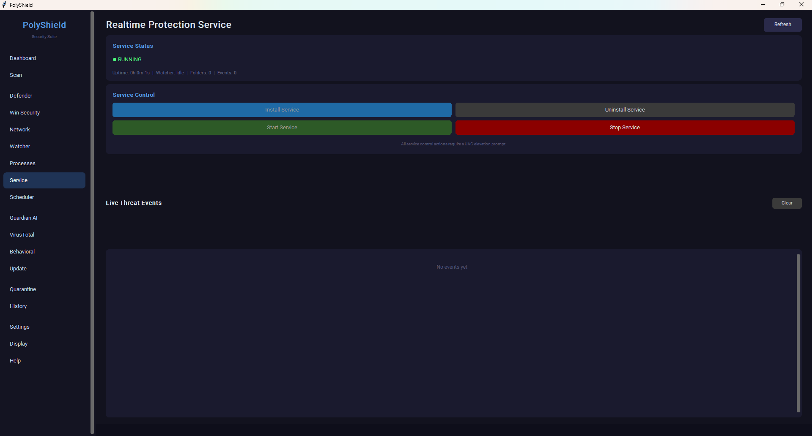
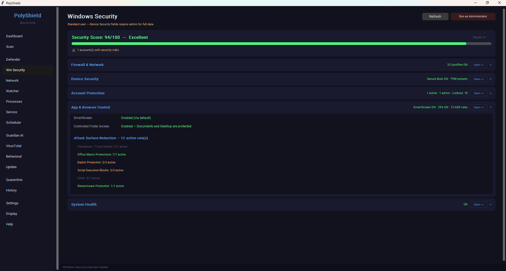

# PolyShield Security Suite

> Multi-engine open-source security suite for Windows — built to **supplement Windows Defender, not replace it.**


---

PolyShield runs **six security engines in parallel** through a unified UI: K2 (KicomAV), Microsoft Defender, Guardian AI, YARA, ClamAV, and Speakeasy. All five secondary engines are reorderable, individually toggleable, and configurable per-sensitivity. There's a Windows Service for always-on file-watching, a VirusTotal smart-upload flow (hash-first, never uploads what's already known), and a per-pattern false-positive tracking system that learns which heuristics you trust over time.

No telemetry. No cloud upload of your files (unless you opt into VirusTotal with your own API key). No vendor lock-in.

## Screenshots


*Scan view: six-engine pipeline with drag-to-reorder, scan-type tabs, custom path drop zone, and per-engine status badges.*


*Service view: install, start, and stop the PolyShield Windows Service; live threat event feed.*


*Windows Security view: composite security score, ASR rules, Controlled Folder Access, and Secure Boot / TPM status.*

---

## Why PolyShield?

Commercial AV products have telemetry, ad-ware components, and they replace Defender (which is actually pretty good). The open-source AV world has K2, ClamAV, YARA, and a few others — but each is a CLI tool. **PolyShield is the missing UI** that turns these into a coherent product:

- **Five-engine consensus on every scan** — disagree-and-vote rather than trust one verdict
- **Defender stays your primary** — PolyShield doesn't fight it, just adds layers
- **You see exactly what each engine said** — no black-box "Threat detected" without details
- **Dispute resolution** — when engines conflict, you decide; the system remembers your verdict and tracks each engine's false-positive rate over time

## Key features

- 🔬 **6-engine scan pipeline** — K2 / Defender / Guardian AI / YARA / ClamAV / Speakeasy, fully reorderable
- 🛡️ **Windows Service** — `PolyShield Realtime Protection`; survives logout, starts at boot, low-privilege by design
- 🌐 **VirusTotal smart upload** — hash-first lookup; only uploads if no existing record
- ⚖️ **Dispute resolution** — per-engine false-positive tracking + manual override system
- 🎚️ **Sensitivity profiles for Guardian AI** — Conservative / Balanced / Power, plus per-pattern toggles
- 🐉 **Behavioral analysis** — optional Speakeasy PE emulation for unknown executables
- 🔄 **Self-updating threat intelligence** — MalwareBazaar hashes, C2 blocklists and YARA rules refresh on a schedule; the Dashboard tells you when they are going stale, and says so plainly if a feed downloaded but isn't usable
- 🚨 **Every engine's real-time verdict is recorded and alerted** — a Guardian hit no longer suppresses YARA's or ClamAV's finding on the same file, and the service event log shows the actual result instead of "pending"
- 🐳 **Container traffic is not treated as suspicious** — Docker, WSL2 and Hyper-V bridge ranges are recognised as local, so container processes stop being flagged as unsigned outbound connections
- ⏸️ **Stop and Pause take effect immediately** — including during the file-counting phase of a Full scan, where the request used to be silently discarded
- 🔐 **Quarantine kept under Defender's watch** — second line of defense by design (not by accident)
- 🚀 **No telemetry, no cloud-by-default, no API keys required**

## Quick start

### Install it (no Python needed)

Run **`PolyShield-Setup-<version>.exe`**. It needs administrator rights, and it:

- installs the program to `C:\Program Files\PolyShield`
- creates `C:\ProgramData\PolyShield` with per-folder permissions, so an
  ordinary program cannot rewrite the threat data the service trusts
- registers the PolyShield service and starts it
- adds *Scan with PolyShield* to the Explorer right-click menu

Uninstalling removes all of that. **It keeps your quarantine, logs and
settings** unless you tick the box asking it not to — a quarantined file may be
the only copy you have left.

Verified on a machine with no Python, no developer tools and no source tree:
47 checks covering install, reinstall over a broken previous attempt, and
uninstall.

### Or run from source

**Prerequisites**: Windows 10 / 11, Python 3.11+, administrator rights for the Windows Service install.

```powershell
git clone https://github.com/xaerogonzo/Polyshield-Antivirus.git
cd Polyshield-Antivirus
.\scripts\install.bat
```

This creates the portable venvs, installs the engines, and offers to register the Windows Service. The UI launches via `launch_ui.vbs` (or `scripts\dev\launch_ui.bat` for a console window).

### Or build the installer yourself

```powershell
.uild.bat -BuildRuntime -Onefile -Target all
.uild.bat -Target installer
```

Needs [Inno Setup](https://jrsoftware.org/isinfo.php) (`winget install JRSoftware.InnoSetup`); the build says so if it is missing.

Full step-by-step install guide, daily workflow, and troubleshooting → **[docs/USAGE.md](docs/USAGE.md)**

## Installing from source

`scripts\install.bat` builds the virtual environments. To make the checkout
behave like an installed product:

```bat
scripts\install_dev.bat
```

It self-elevates and registers, against **this checkout**:

- `PolyShieldService`, set to start automatically at boot, with restart-on-failure
- *Scan with PolyShield* in the Explorer right-click menu
- optionally a startup entry — it asks, and the default is **no**
- an entry in Settings > Apps, named *PolyShield Security Suite (development install)*

Nothing is copied. Every registered command points at the folder you are editing,
so changes take effect on the next launch (or `sc stop` + `sc start` for the
service). **Moving or renaming the folder invalidates all of them** — the
Dashboard notices and offers a Repair button, or just re-run the script.

To undo everything:

```bat
scripts\uninstall_dev.bat
```

Or use Uninstall in Settings > Apps, which runs the same script. Either way your
quarantine, logs, settings and threat database are kept — the uninstall removes
registrations, not data, and not the checkout.

### Starting with Windows

Off by default, in every path: the Settings switch, the `[y/N]` prompt in
`install_dev.bat`, and the (unticked) task in the packaged installer. When it is
on, PolyShield starts minimised to the notification area and appears in Task
Manager > Startup, where you can turn it off — and Settings will say so rather
than claiming it is still enabled.

### PolyShield and Microsoft Defender

PolyShield is **not** a Windows Security Center-registered antivirus and does not
replace Defender as the antivirus Windows knows about. It runs alongside it,
adding real-time file, process and network monitoring, and it drives Defender's
own scanner as one of its detection engines. The Defender page says which of the
two is actually protecting the machine at any moment, including when the answer
is "neither".

## Detection engines

| Engine | What it does | Author |
|---|---|---|
| **K2** (KicomAV) | Signature-based scanner — primary detection layer | Kei Choi — [hanul93/kicomav](https://github.com/hanul93/kicomav) |
| **Defender** | Microsoft Defender via `MpCmdRun.exe` | Microsoft |
| **Guardian AI** | Hash DB + 7 heuristic patterns; tier-aware verdicts | Matt Emilien — [MattEmilien/GuardianAI](https://github.com/MattEmilien/GuardianAI) |
| **YARA** | Rule-based pattern matching | VirusTotal — [yara](https://github.com/VirusTotal/yara) |
| **ClamAV** | Community signature database | Cisco Talos — [clamav](https://github.com/Cisco-Talos/clamav) |
| **Speakeasy** | Pure-Python PE behavioral emulator (optional) | Mandiant — [mandiant/speakeasy](https://github.com/mandiant/speakeasy) |

Full attribution, license info for every dependency, and acknowledgements → **[NOTICES.md](NOTICES.md)**.

## Documentation

| Document | Covers |
|---|---|
| **[docs/USAGE.md](docs/USAGE.md)** | Install, daily workflow, every feature, troubleshooting (long-form reference) |
| **[docs/ARCHITECTURE.md](docs/ARCHITECTURE.md)** | Internals: scan pipeline, database schema, threading patterns |
| **[docs/WINDOWS_SERVICE.md](docs/WINDOWS_SERVICE.md)** | Windows Service implementation deep-dive |
| **[docs/TESTING.md](docs/TESTING.md)** | Test procedures, EICAR sprint, service-recovery tests |
| **[docs/VM_SETUP.md](docs/VM_SETUP.md)** | Windows 11 VM setup for safe field testing |

## Contributing

Contributions, bug reports, and engine integrations welcome. See **[docs/USAGE.md → Contributing](docs/USAGE.md#contributing--local-development)** for the local dev workflow.

If you spot an attribution issue in [NOTICES.md](NOTICES.md), open an issue or PR — accurate credit matters.

## License

PolyShield is **MIT-licensed** — see [LICENSE](LICENSE). The bundled engines retain their own licenses; full breakdown in [NOTICES.md](NOTICES.md).

---

<sub>Created by Alexander L Corthell. Engines by their respective authors. The architecture and integration are what PolyShield contributes — the detection work is the heroes of the open-source AV world.</sub>
